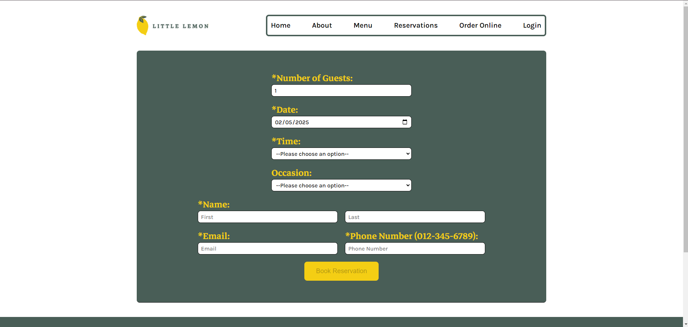
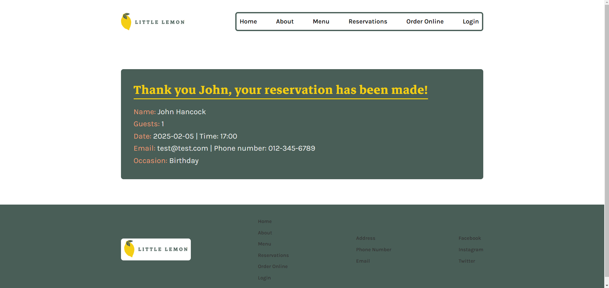

# Little Lemon

Little Lemon is a restaurant website prototype built as part of the **Meta Front-End Developer Capstone** course. The project focuses on responsive design, modern UI/UX principles, and accessibility best practices.

## Features
- User-friendly navigation
- Responsive layout for different screen sizes
- Interactive menu and reservation system (if applicable)
- Optimized for performance and accessibility

## Technologies Used
- HTML
- CSS
- JavaScript
- React (if applicable)

## Screenshots
.png)
.png)
.png)
.png)
.png)



## Setup Instructions
1. Clone the repository:
   ```bash
   git clone https://github.com/yourusername/little-lemon.git
   ```
2. Navigate to the project folder:
   ```bash
   cd little-lemon
   ```
3. Install dependencies (if using a framework like React):
   ```bash
   npm install
   ```
4. Start the development server:
   ```bash
   npm start
   ```

## License
This project is for educational purposes as part of the Meta Front-End Developer Capstone course.
